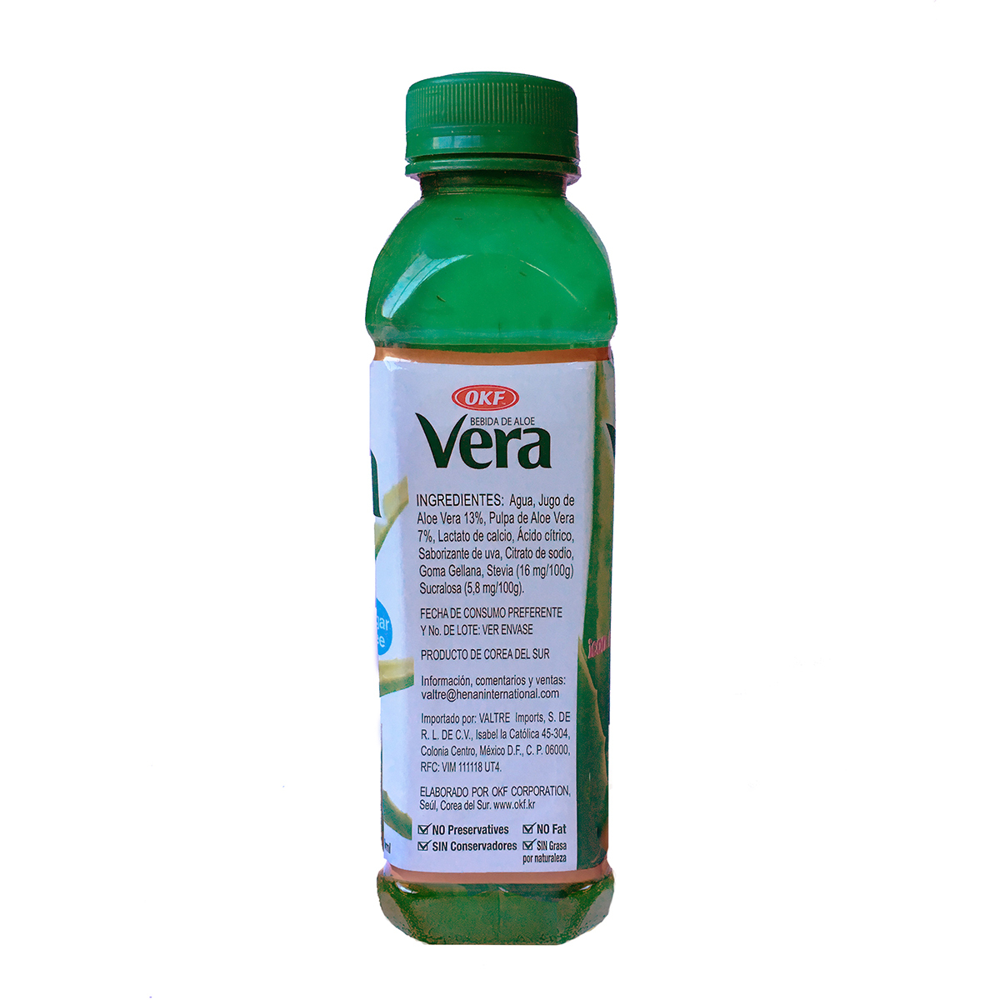
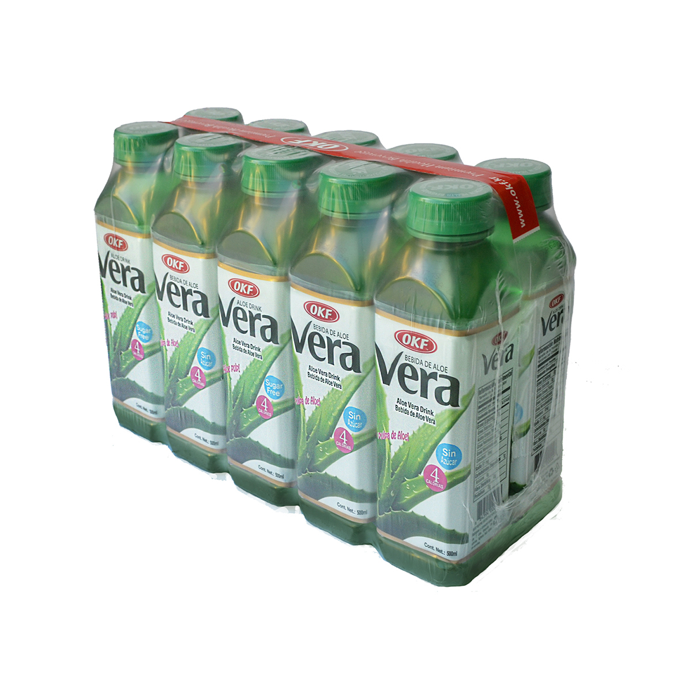

### Precio Original:  ~~$279~~
### Precio Saldodromo:  $190

Bebida refrescante

20% de Sábila/Aloe Vera ( 13% en Jugo y 7% en pulpa),  planta reconocida por sus beneficios.

Contiene vitaminas A y B, C,E, tambien contiene minerales como el hierro, magnesio, zinc, calcio, sodio, potasio.

Ayuda a reducir los niveles de colesterol.

Auxiliar en problemas digestivos.               

No contiene Azúcar.   

Tómese frío.
 

