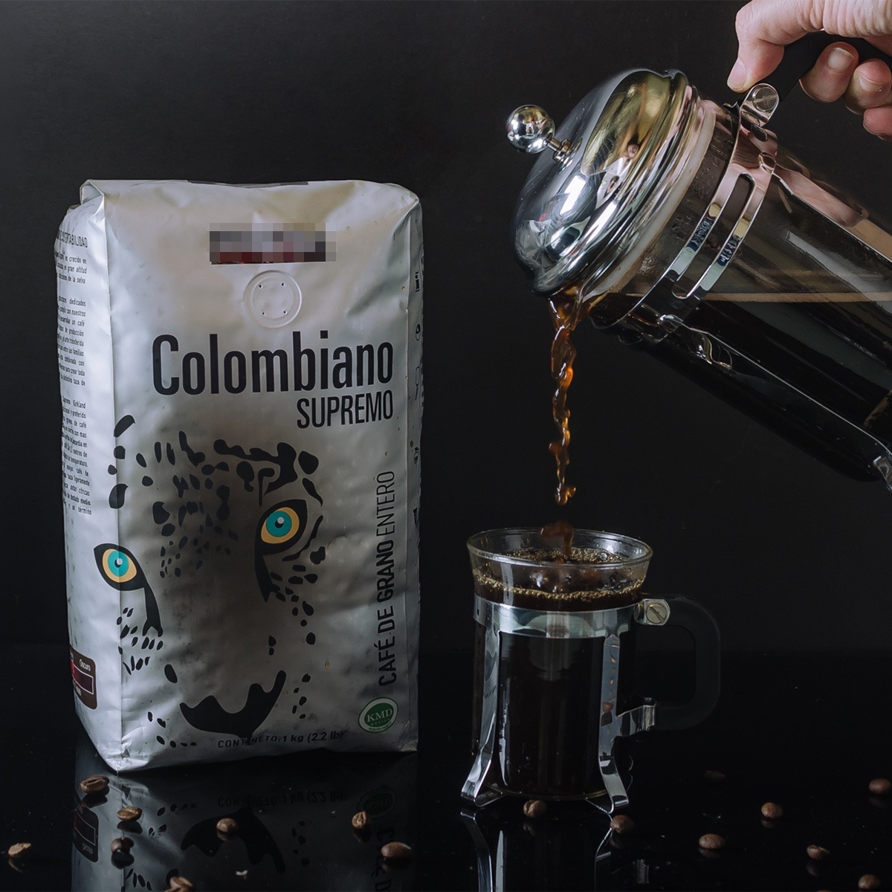
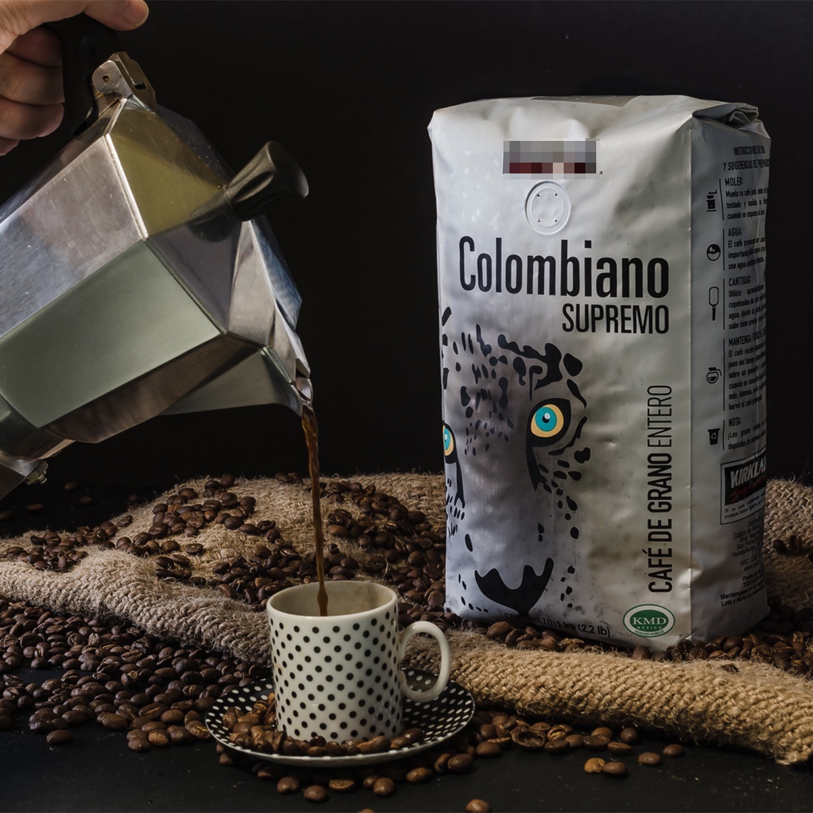

### Precio Original:  ~~$169~~
### Precio Saldodromo:  $109

Café Gourmet de Colombia 100% Arábica.

Los granos de este café colombiano crecen cerca de Medellín en sierras con más de 1,800 metros de altura arriba de Concordia en fincas de café de pequeños productores. Con 2.5 metros de lluvia y un perfecto balance de temperatura y humedad, Concordia produce el mejor café de Colombia. Estas condiciones únicas nos permiten obtener una taza ligeramente dulce, con viveza y notas cítricas brillantes. Es un café de tostado medio con intensos sabores y un término balanceado. 

**Aroma**: Dulce y Floral.

**Sabor**: Dulce, Notas a Chocolate, Nueces y Toques Afrutados.

**Retrogusto**: Prolongado

**Cuerpo**: Completo.

