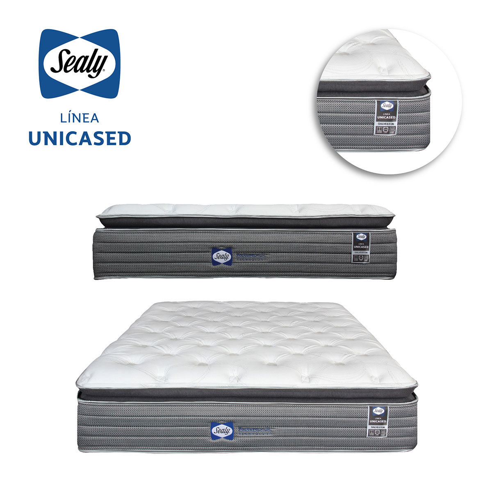
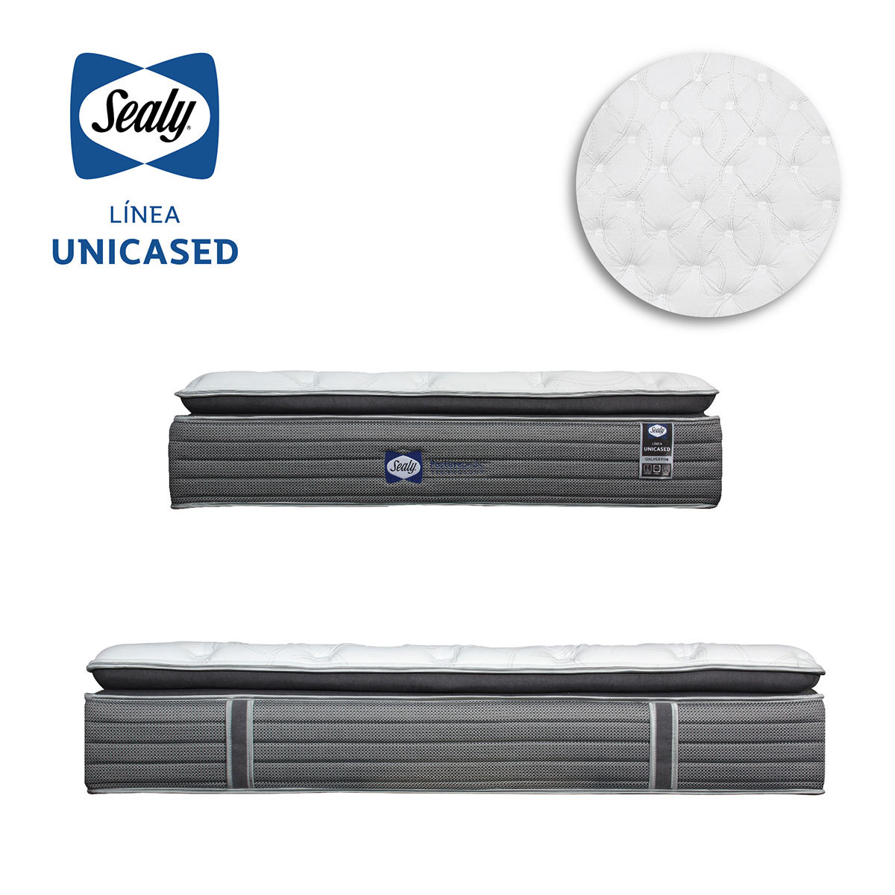
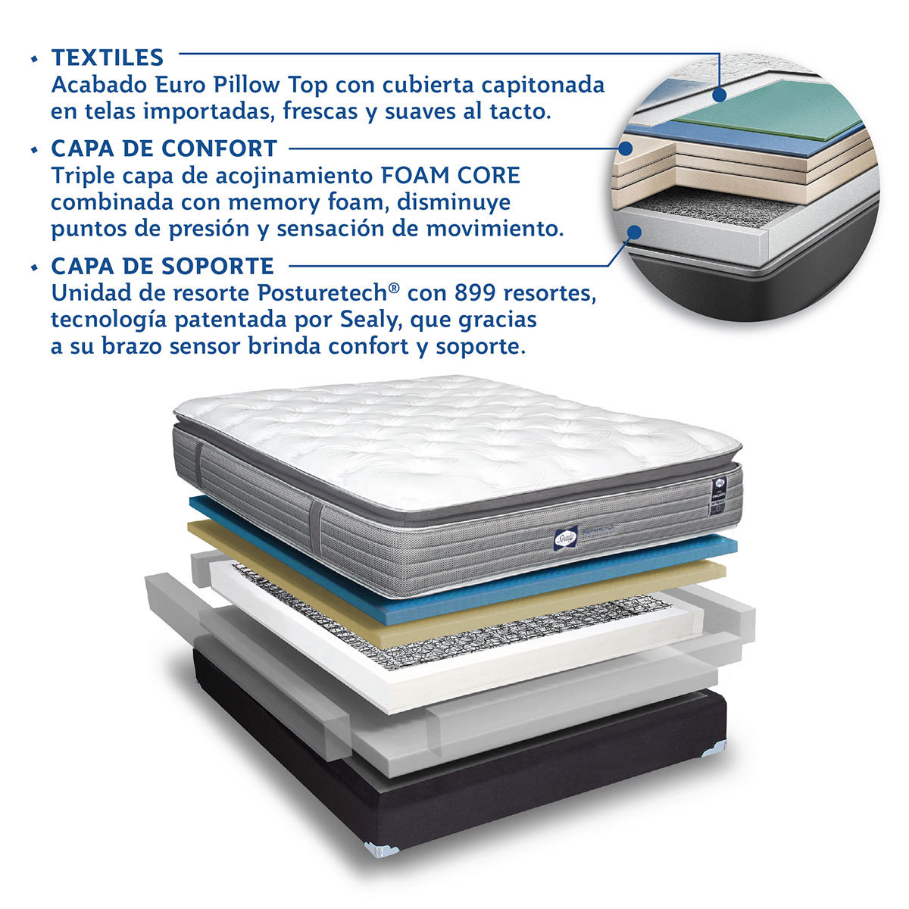
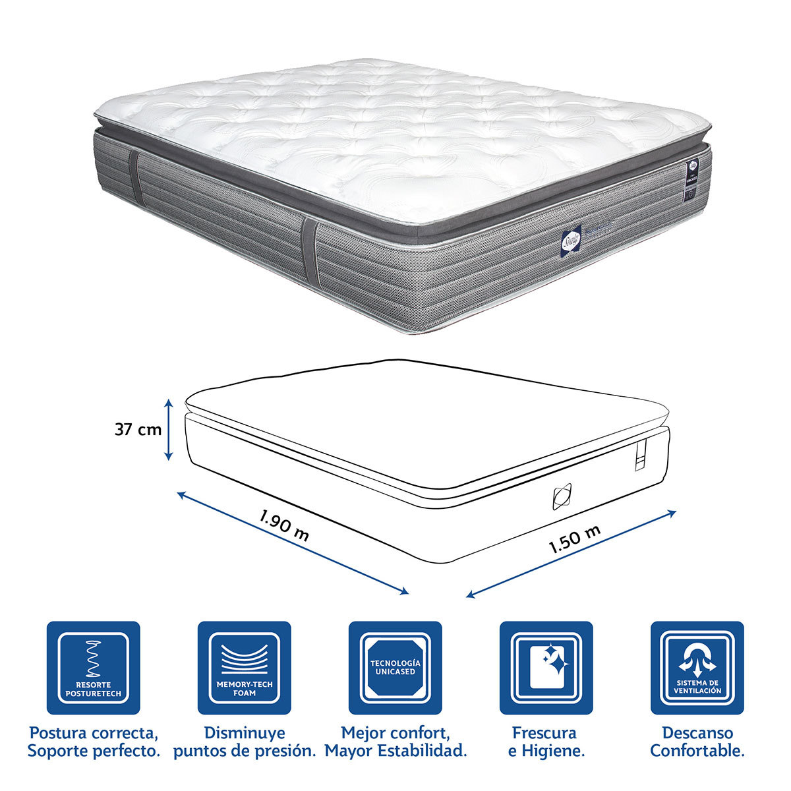

### Precio Original:  ~~$$11,999~~
### Precio Saldodromo:  $6,999
"
Características del artículo:

Dimensiones: 150cm frente x 190cm profundo x 38cm alto.
	Peso: 41kg colchón
	Tamaño de Colchón: Queen
	Marca: Sealy
	Confort: PLUSH
	Estructura Interna: Resortes, Memory Foam, Memory Gel

“Soporte y confort en toda la superficie del colchón, se siente bien en todos lados”

Detalles del artículo:

Tecnología Sealy Unicased®, se adapta a la forma de tu cuerpo, Excelente soporte a lo largo de toda la superficie del colchón “Se siente bien en todos lados”

Cada componente ayuda a reducir la presión sanguínea, dando como resultado que las personas den menos vueltas durante la noche, obteniendo un mejor descanso, lo que brinda una vida más saludable a largo plazo.

Con una colchoneta súper suave en la parte superior estilo Euro Pillow Top y un sistema de resortes encajonado brinda soporte en toda la superficie del colchón, elimina la sensibilidad del resorte además capas de Memory Foam que siempre regresan al estado y forma del material, absorbiendo los puntos de presión, y Memory Gel que ayuda a regular la temperatura corporal y del material.

Alto grado de Confort y Soporte, es lo que define nuestro modelo Galveston; despierta revitalizado y listo para vivir tu día al máximo.

Gozar de un sueño reparador alarga y mejora tu calidad de vida.

Unicased Technology®.
	Tecnología Sealy Posturepedic®.
	Alto grado de Confort y Estabilidad.
	Confort Suave.
	10% más de área de descanso
	Capa de Memory Foam y Memory Gel.
	Fabricado con Memory High Confort®.
	Tela importada, inteligente, fresca; con una superficie que permite la mejor circulación del aire.
	Disminuye los puntos de presión.
	Ofrece un descanso placentero eliminado los movimientos nocturnos.
	Look actual y en tendencia.
	Diseño Americano.
	El colchón se adapta a tu cuerpo, permitiendo la liberación de puntos de presión, su capa de Gel brinda frescura que ayuda a regular la temperatura corporal, permitiendo un descanso reparador.
	Superficie que no se deforma.

