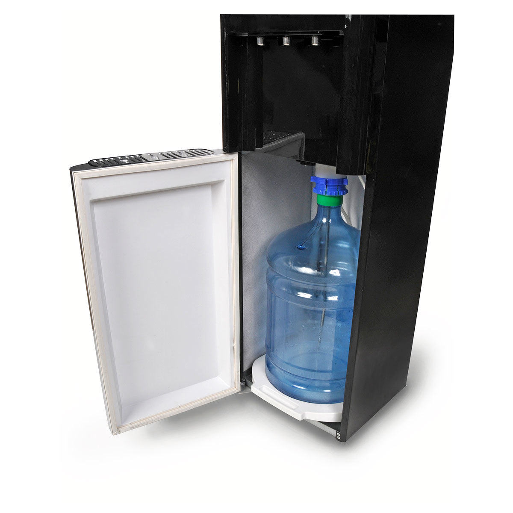
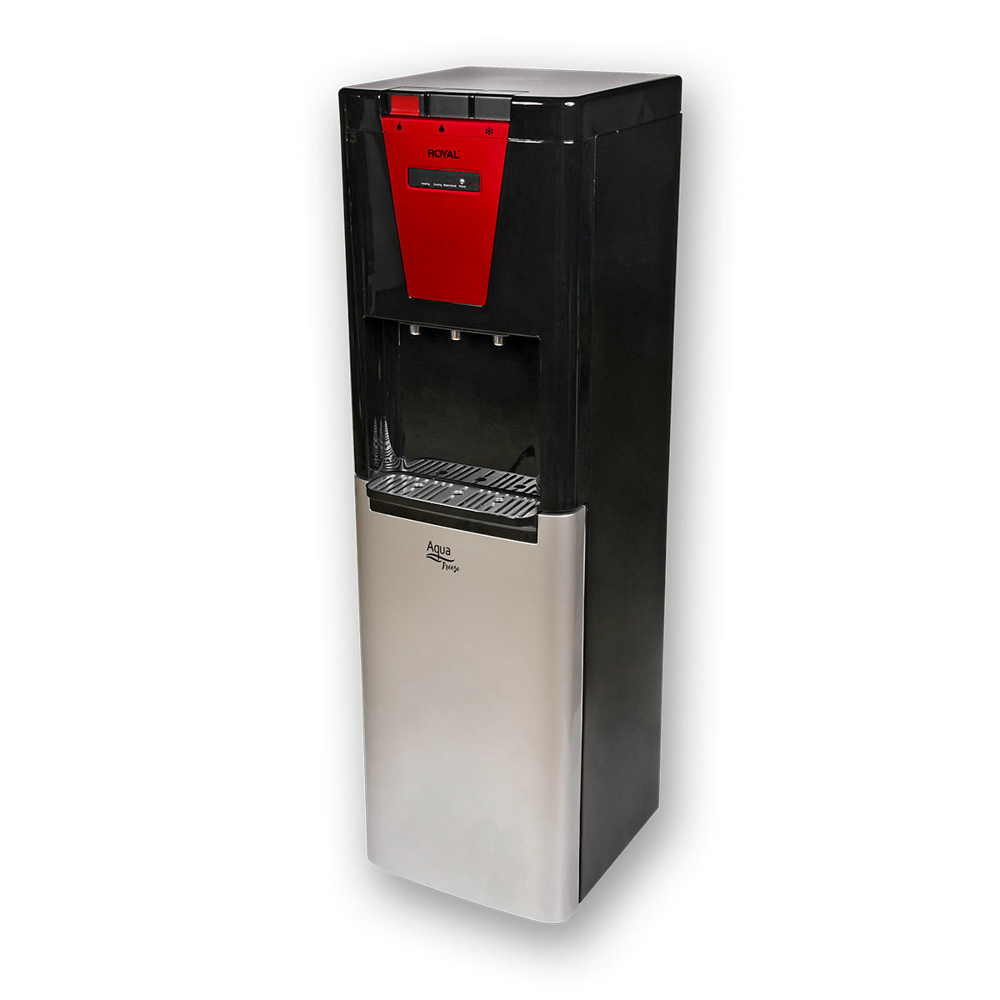

### Precio Original:  ~~$4,699~~
### Precio Saldodromo:  $2,699

Disfrute de este dispensador de agua de la marca Royal perfecto para satisfacer sus necesidades de bebidas calientes y frías su oficina u hogar.

Otras características:
- Enfriamiento de compresor.
- Bandeja de goteo removible.
- Recipiente anti-derrame.
- Seguro de pared.
- Luces LED indicadoras.
- Para garrafones de 3 o 5 galones.
- Agua caliente a 85°C.
- Agua fría entre 4°C y 12°C.
- Bajo consumo de energía.
- Controles con seguro para niños.
- Tecnología cooling fresh.
- Mangueras fabricadas en acero inoxidable y sometidas a tratamiento para evitar la aparición de gérmenes y bacterias.

Encuentranos también en Mercado Libre:
https://articulo.mercadolibre.com.mx/MLM-855518481-dispensador-de-agua-marca-royal-_JM
