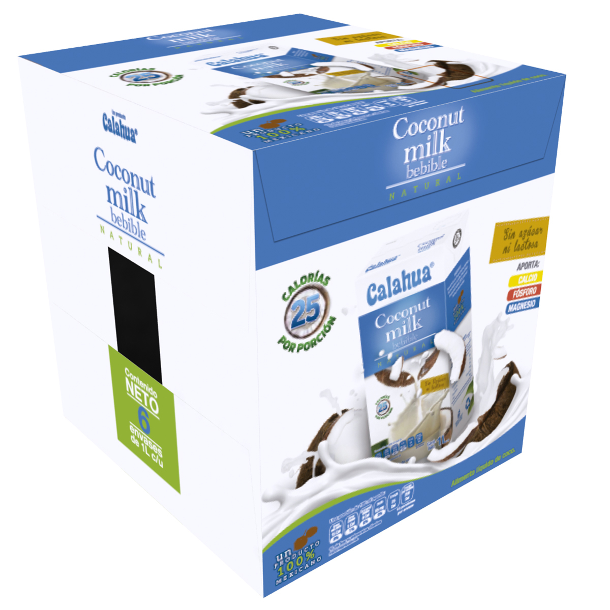

### Precio Original:  ~~$219~~
### Precio Saldodromo:  $149

Alimento liquido de Coco Bebible.

Apariencia: Liquido cremoso de color blanco a ligeramente beige con olor y sabor característico a coco.
Color: Blanco a ligeramente beige.
Sabor: Lechoso con notas acentuadas sabor coco.
Olor: Característico a coco y exento de notas desviadas.
Sin azúcar, libre de lactosa y gluten.
25 calorías por porción.
Producto Kosher.
Sin colorantes, aromatizantes ni colorantes artificiales.
100% mexicano.

