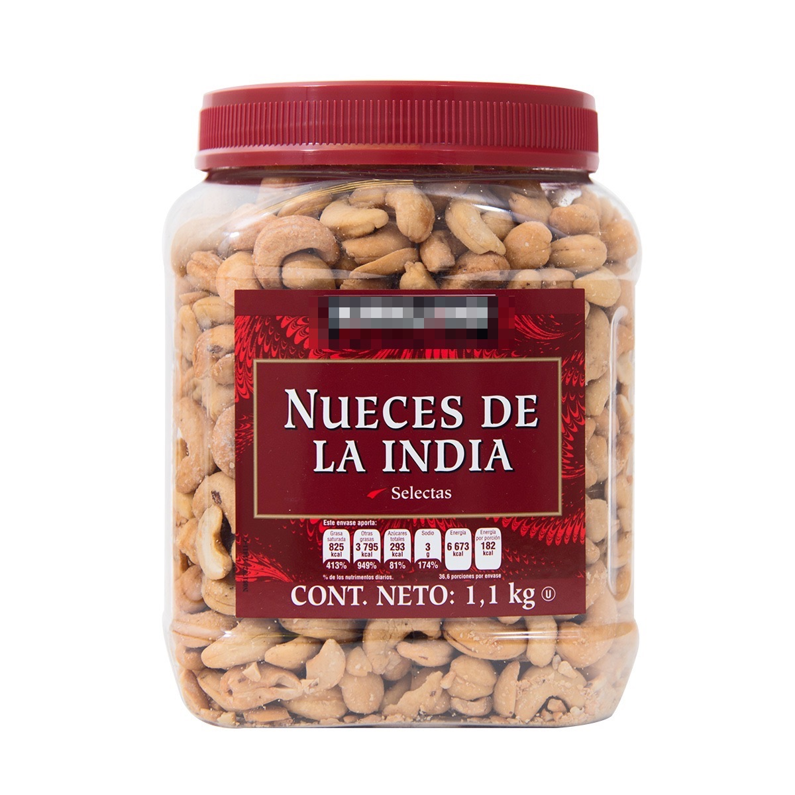
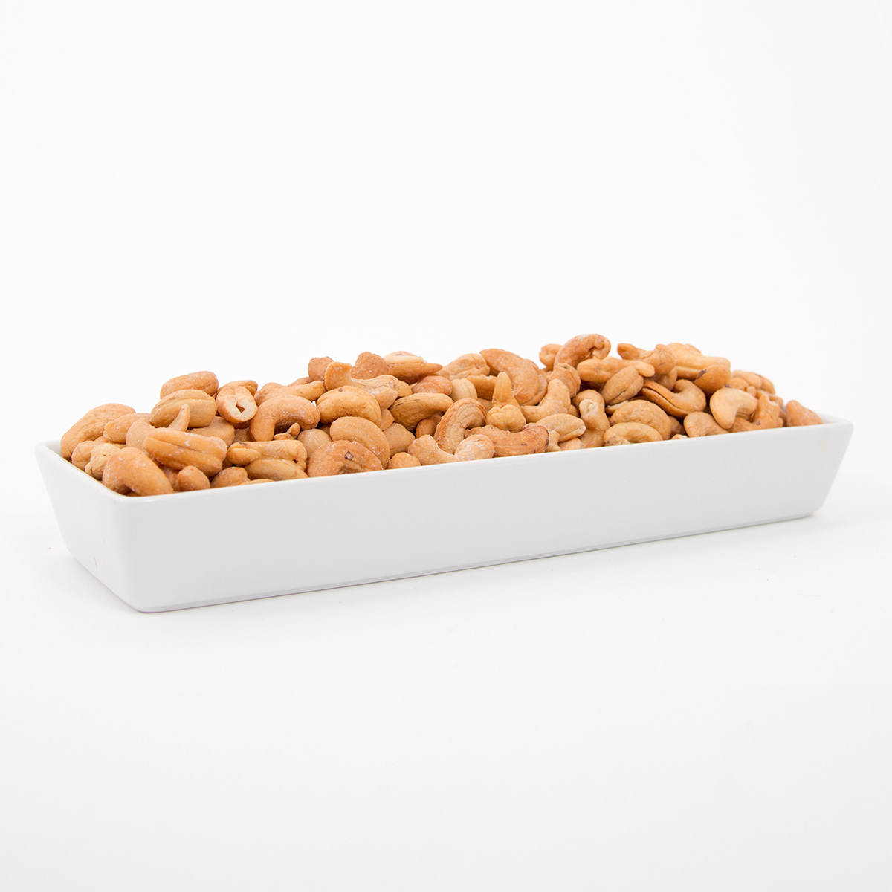

### Precio Original:  ~~$499~~
### Precio Saldodromo:  $295

Las nueces de la India son un producto con calidad premium. Están envasados en frascos de plástico prácticos para conservarlos fuera de la humedad desde el transporte hasta que se abren en casa. Se asan con aceite de cacahuate y sal buscando el punto óptimo para su sabor. Es un producto Kosher ya que para su elaboración se respeta los preceptos de la religión judía. Se consideran ideales para botana o para cocinar.

