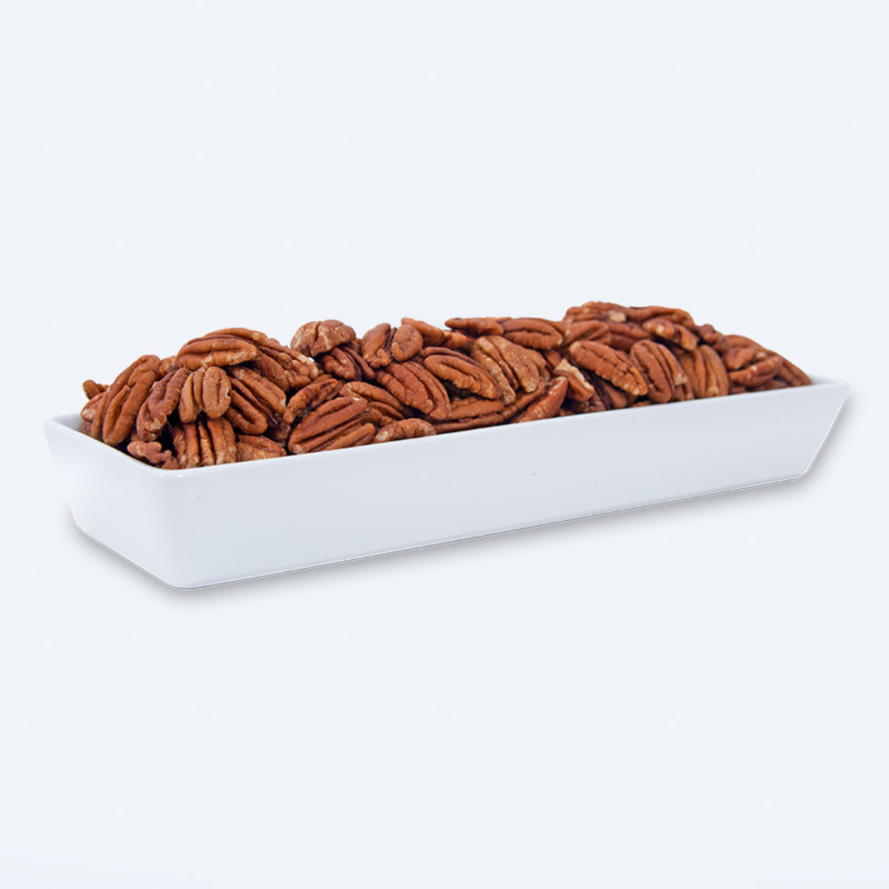

### Precio Original:  ~~$360~~
### Precio Saldodromo:  $260

La nuez pecana es rica en nutrientes, fibra y es libre de colesterol. Tiene un relleno crujiente acompañado de un delicioso sabor. Completamente natural y sin conservadores, simplemente lo mejor. Es un producto Kosher ya que para su elaboración se respeta los preceptos de la religión judía.

Almacenamiento: Debe de refrigerarse después de abierto para una frescura óptima.

