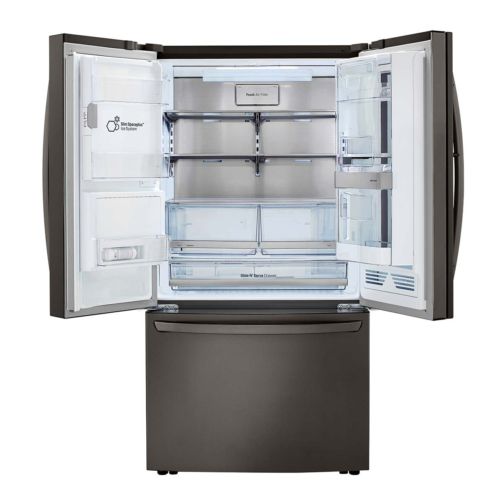
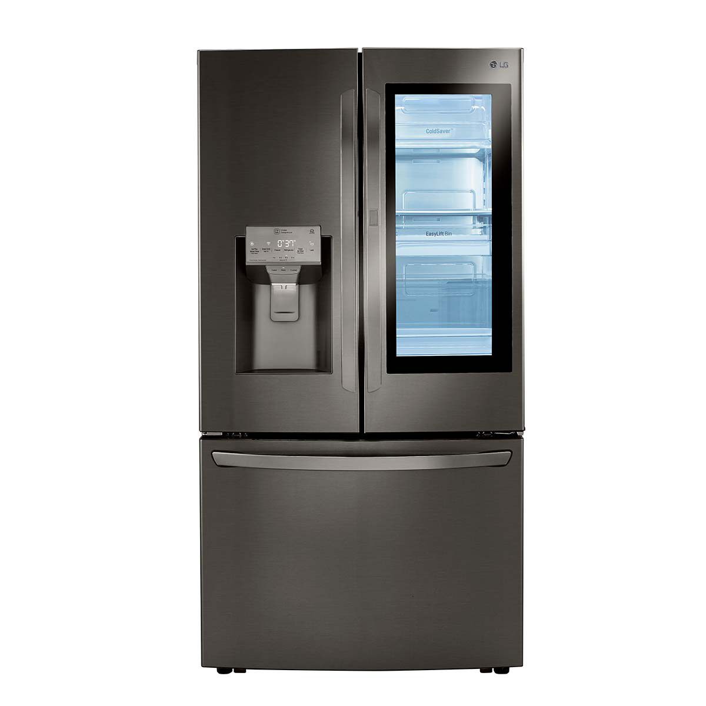
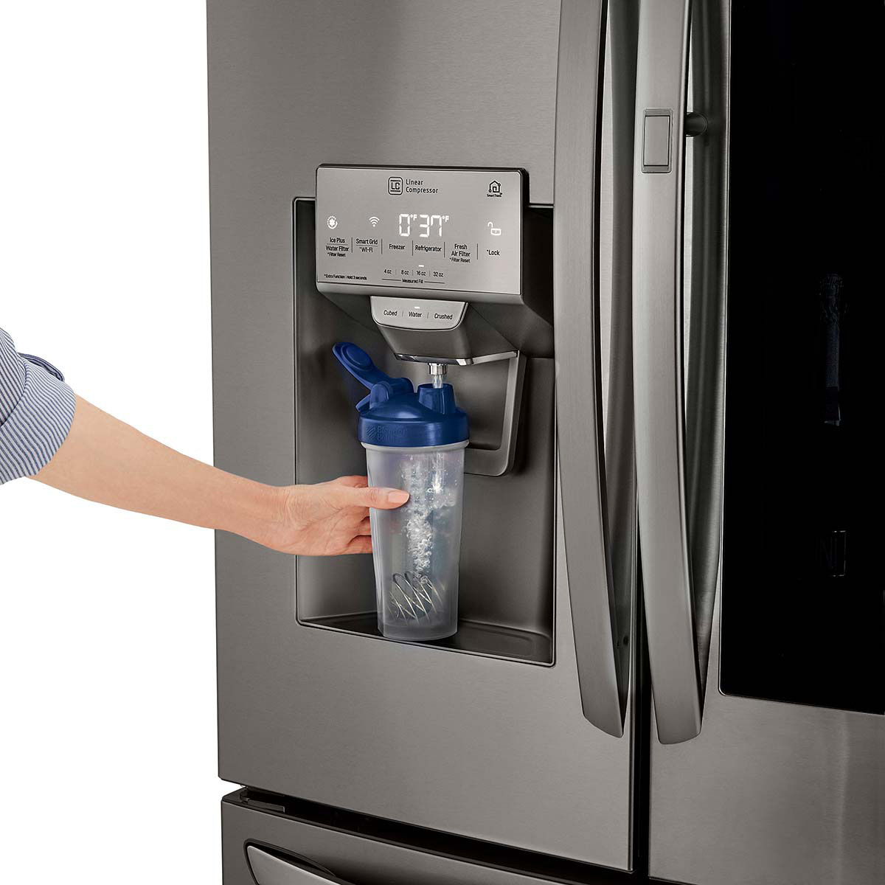
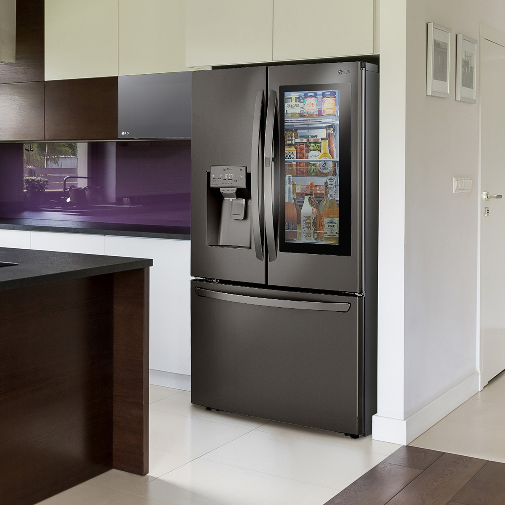

### Precio Original:  ~~$69,999~~
### Precio Saldodromo:  $46,999

Fábrica de Hielos Dual y Hielos en Esfera Craft Ice™ Exclusivos de LG

La fábrica de hielo dual con hielos en esfera Craft Ice™ crea automáticamente hielo triturado, en cubos o en forma de esfera de lenta disolución exclusivos de LG. Descubre un nuevo mundo de bebidas de alta gama y mantén tus refrescos, la limonada y el café helado con el mejor sabor.

InstaView Door-in-Door™ 

Los refrigeradores LG InstaView Door-in-Door™ cuentan con un panel de cristal de espejo que con solo dos pequeños golpes se ilumina, permitiéndole ver el interior de su refrigerador sin necesidad de abrir la puerta. Reduciendo así la perdida de aire frío, manteniendo los alimentos frescos por mucho más tiempo.

Puerta LG Door-in-Door™ 

La innovadora puerta LG Door-in-Door™ facilita el acceso a sus alimentos favoritos. Gracias a su avanzado marco delgado de Door-in-Door ™, hay un 9 más de espacio interior y las repisas adicionales le brindan otra manera de mantener su refrigerador organizado mientras reduce la perdida de aire frio hasta un 41% menos.*

Ahorro de energía 

Hasta 32% menos consumo de energía gracias al accionamiento de pistón lineal del Compresor Linear Inverter exclusivo de LG, generando menos fricción interna, respaldado por una garantía de 10 años

Características: 

- Fábrica de Hielos Dual
- Craft Ice™
- InstaView Door in Door™
- Linear / Door Cooling
- Hygiene Fresh
- Metal Flat Duct (CoolGuard™)
- Surface LED lightning
- 1 repisa plegable
- Temperature controlled pantry (-1°C, 1°C, 3°C)
- 2 cajones con control de humedad - Manija de fácil apertura
- Cajon de congelador doble
- Smart Care+
- SmartThinQ™
- Smart Diagnosis™

