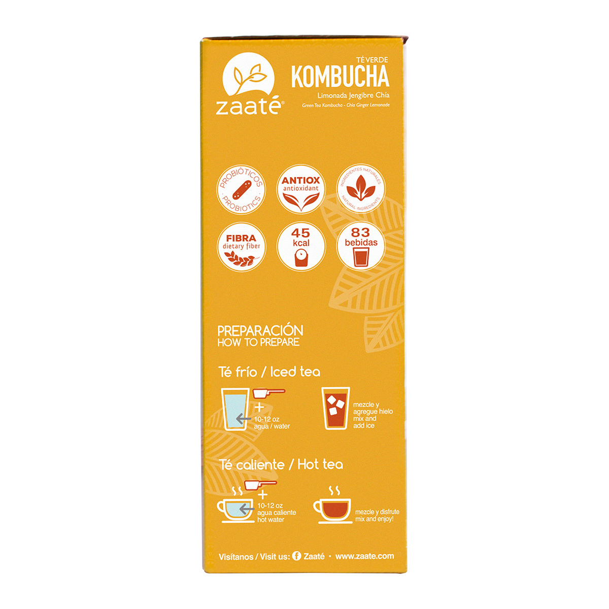

### Precio Original:  ~~$279~~
### Precio Saldodromo:  $190

Té verde Kombucha tisana limonada jengibre chía.

ZAA TÉ® Tisana es una excelente opción para disfrutar del sabor, los beneficios y la versatilidad de preparar un té en cualquier momento del día. Estos productos combinan a la perfección ingredientes 100% naturales como extracto de té, llevándote a experimentar un delicioso sabor inigualable.

Este sabor no es todo... con esta bebida aprovecharás al mismo tiempo los beneficios de las diversas variedades de té. Disfrútalo a cualquier hora del día y a la temperatura que más te guste; caliente o frío.

Desde la antigüedad en China se disfrutaba de los beneficios de la bebida fermentada KOMBUCHA que ahora ZAA TÉ® trae para ti con sus innumerables propiedades y un delicioso sabor a limón y jengibre.
 
		                    "

